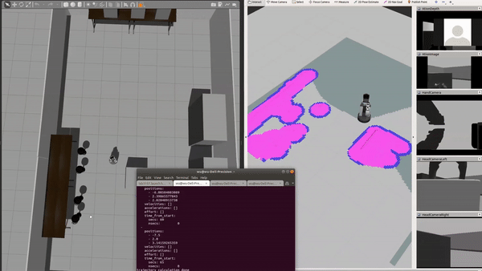

 Fig 1. The robot running in Gazebo-simulated Lab setup

 
My research on motion planning began during the second year of my undergraduate studies with <strong>Prof. Kira Barton</strong> at the University of Michigan. Our project's goal was to enable the mobile robots to navigate autonomously in a factory that featured an initial map but contained uncertain dynamic obstacles. The main challenge of the project was that the motion planner had to quickly adjust robot paths while guaranteeing collision avoidance and motion coherence. However, most search-based approaches replan the entire path, involving a large computational complexity and preventing the robot from finishing the calculation while moving. On the other hand, sampling-based methods can find a solution quickly but may have difficulties generating a smooth path. 
  
To bridge this gap, I proposed a dynamic object avoidance offset to the robot's local controller, reducing the need to replan the entire path and increasing the speed in path adjustment calculations. Leveraging the initial knowledge of the map, my motion planner starts with a pre-planned path to the goal and then continuously detects possible collisions. If a collision is pending and free space is available around the blocking obstacle, the planner offsets the path segment to reorient the robot instead of initiating expensive replanning. The offset is calculated based on the obstacle shape and relative position, and replanning is only executed when the planner cannot find free space in the robot's moving direction to reorient the robot. 
  
With my work, the robot could avoid unknown obstacles in the Gazebo simulation and the actual lab setup, with a speedup of 60% compared to search-based baselines. During this process, I have written codes to control the robot using the ROS framework, analyze the laser scan, apply outlier removal, and calculate pose offsets. To put my path planner into practice, I also actively collaborated with other members of the Barton Research Group to integrate my planner into a fully automated parts transportation process. This project motivated me to conduct future research and strengthened my goal to explore sensor-based motion planning.

