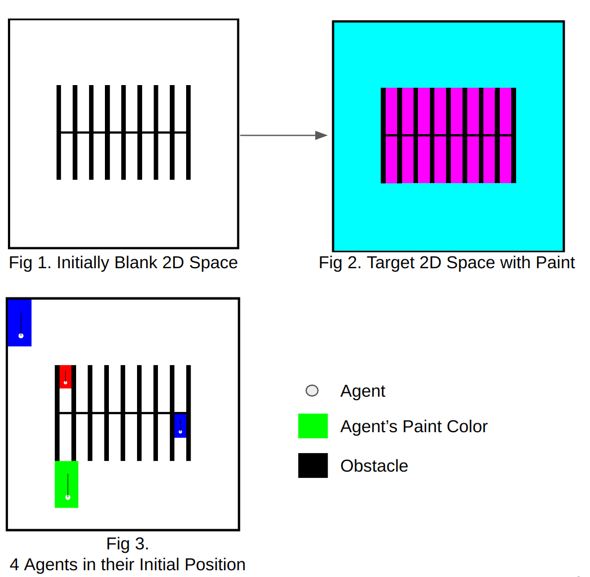
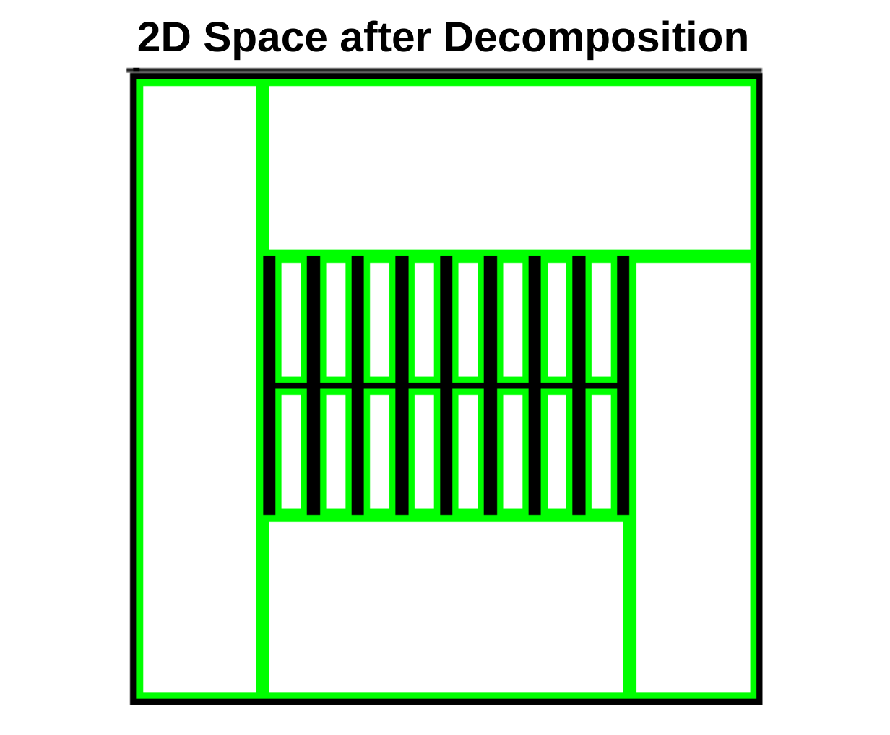
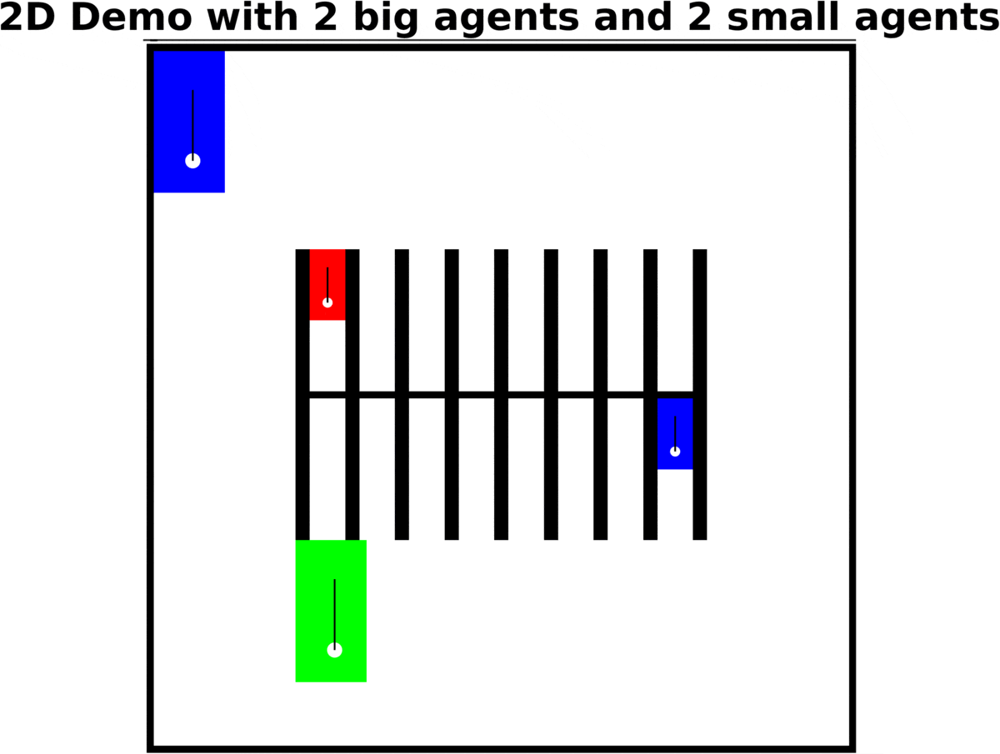
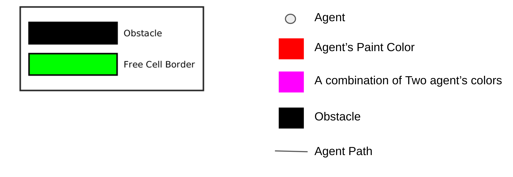

 

While working on the project of In-situ 3D repair, I have been wondering how robots should be coordinated when the problem extends to more agents and heterogeneous functions. The problem of maximizing the robot team's overall efficiency while avoiding collisions in a common workspace is still an open problem. The purpose of this task is to investigate formulating an efficient task scheduling structure to approach the heterogeneous multi-robot coverage problem.
  
As a starting point, I came up with a 2D toy example, which featured a 2D empty canvas with obstacles and a target pattern waiting to be painted by robots. There are two big agents with larger collision sizes as well as painting area. On the other hand, the two small agents can only paint a smaller area at a time but can reach narrow lanes due to their smaller collision sizes. More than that, each agent only carries a fundamental color, e.g. red or blue, and they have to collaborate with other agents to combine their colors to accomplish the desired color, e.g. purple.
  
The solution I proposed was a motion planning pipeline that would generate paths for each agent that to collectively cover the target space with desired color. The planner would begin by applying Boustrophedon decomposition to identify free cells in the space, as shown in Figure 4 below. After that, free cells were assigned to different agents based on their color and painting sizes. The last step was local coverage trajectory geneation, e.g. zig-zag path. The demostration on the toy example can be found in Figure 5 below. 
  
During the implementation of the planner, I have took the advantage of object-oriented design and utilized a generalized agent data structure for code organization and reusability. The codes were implemented in Matlab and can be found <a href="https://github.com/YuchenWu2001/Heterogeneous_coverage_2d">here</a>. In the future, I plan to expand this work to more complicated target pattern, e.g. the painting of logo, as wellas more sophisicated multi-agent collaboration, such each agent contains multiple types of color.

 
Fig. 4: The 2D canvas after applying Boutrosphedon decomposition. Fig 5. The demonstration of 4 agents collectively cover the canvas to achieve the target pattern.

