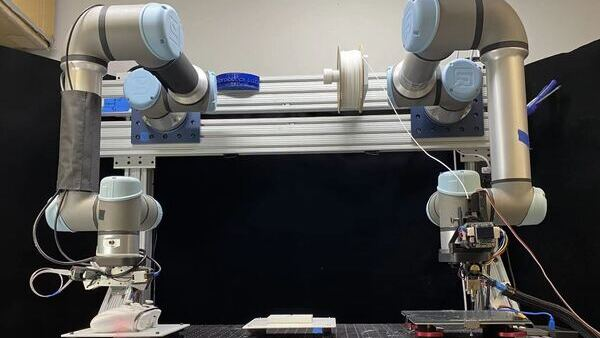

 

  
  
  Fig. 1: Dual-arm System Demonstration. (a) the dual-arm system setup, with a 2D laser profiler attached to the left arm and 3D printing head equipped on the right arm; (b) the two arms are collaborating to fix a gap on a circular-shape part.

<h2>Background</h2> 

One open problem in traditional additive manufacturing processes is the lack of in-situ process monitoring and inspection, which is caused by machinery executing scheduled trajectories and cannot react if an error occurs midway. To tackle this problem, our team designed a dual-robot-arm assembly that combined the sensing capability and manufacturing ability into one system by featuring a left arm utilizing a 2D laser profiler and a right arm equipped with a 3D printing head. 

  
  Fig. 2: In-situ Repair Planner Methodolgy Structure.

<h2>Methodology</h2>

Leveraging the potential of dual robot collaboration, I have proposed a scan-plan-repair paradigm, enabling additive manufacturing technology to adjust the current process based on sensory feedback. The dual-arm system starts with acquiring information regarding the work progress by achieving 3D  scan coverage of the working parts. My algorithm then initiates high-level planning by determining if defects have occurred on the working parts. Through point cloud registration and comparison, the planner identifies defects by finding the difference between the scanned and target models. The motion planner finally fixes any defects via non-planar 3D printing. One of the critical problems during this process was avoiding collision between the robot arms when collaborating. By identifying the collision geometries of both robot arms in real time and defining those volumes as critical sections, my dual-arm motion planner could successfully coordinate the two robot arms to repair multiple test pieces.

<h2>Results</h2>

We have tested our work against multiple test pieces and yield satisfying results in terms of point cloud difference between ideal model and fixed model, as well as the quality of the 3D print. We are currently submitting our work to RSS'23 and please stay tuned for more updates!

## Resources
[[Poster](https://yuchenwu2001.github.io/files/AM_Poster.pdf)] [[Video](https://bit.ly/dual_arm_demo)] 

